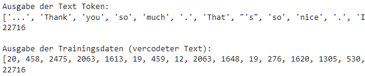
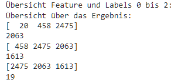
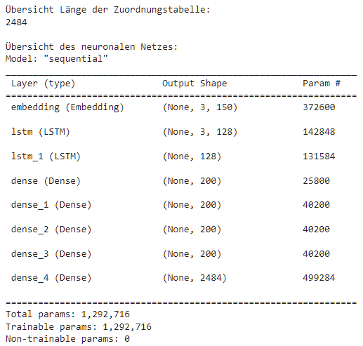
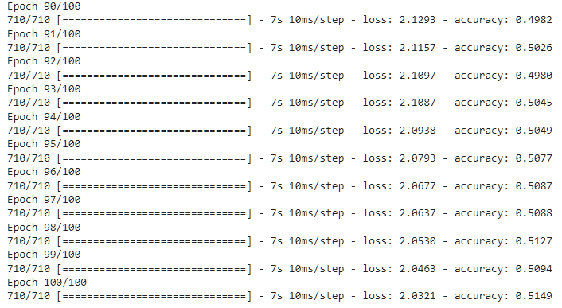
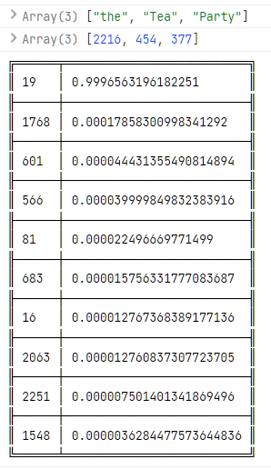
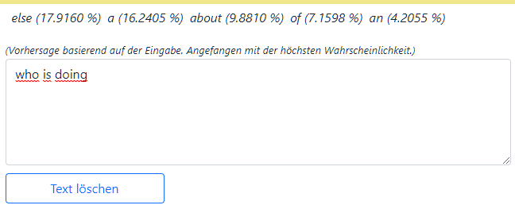
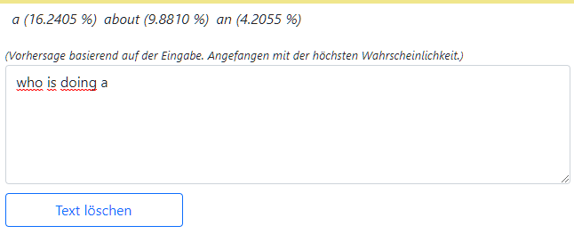

---

**Deep Learning**

**Dozent: Prof. Dr. Felix Gers (Berliner Hochschule für Technik)**

**Studiengang Medieninformatik Online MA, Sommersemester 2022**

**University of Applied Sciences Emden/Leer, Faculty of Technology, Department of Electrical Engineering and
Informatics**

---

### Einsendeaufgabe EA4 : Wortvorhersage mit einem Recurrent Neural Network (RNN) Model und TensorFlow.js (TFJS) als Framework/API.

Mit Hilfe eines Recurrenten Neuronalen Netzwerks (RNN) soll ein Modell erzeugt werden, das auf der Basis seiner
Trainingsdaten Wortvorhersagen (Next Word Prediction) machen kann.

[zur Webseite](https://deep-learning.ckitte.de/ea4/)

## Umsetzung

Die Umsetzung wurde auf Grund der rechenintensiven Arbeit und besseren Möglichkeiten aufgeteilt. Die **Vorverarbeitung**
der zugrundeliegenden Textdaten, die **Modellentwicklung** und das **Training** erfolgte in
einem **[Jupyter Notebook]("https://github.com/ChristianKitte/DeepLearningWordPrediction/blob/main/Wortvorhersage.ipynb")**
unter Verwendung von TensorFlow mit Python. Das so trainierte neuronale Netz wurde im Anschluss in ein für TensorFlow.js
verarbeitbares JSON Format umgesetzt.

Für die **webseitige Anwendung** wurde primär auf **Tensorflow.js** und JavaScript zurück gegriffen um die Logik zur
Eingabe und Vorhersage in einer Browseranwendung umzusetzen.

Insbesondere bei der Datenvorverarbeitung kamen in starkem Maße weitere Bibliotheken und Tools zum Einsatz. Dies
bedeutet jedoch nicht, dass deren Einsatz alternativlos ist. Viele der Arbeiten können auch direkt und einfach ohne
Hilfe umgesetzt werden. Insofern stellen sie eine Vereinfachung dar, bieten darüber hinaus aber durch ihre hohe
Optimierung gerade bei großen Datenkontingenten einen nicht zu unterschätzenden **Performance** und **Qualitätsgewinn**
dar.

## Lösung

Für die Lösung existiert keine eindeutig richtige oder falsche Lösung. Auch die hier vorgestellte Lösung hat somit Vor-
aber auch Nachteile und kann sicherlich weiter optimiert werden. Hier musste ein Kompromiss zwischen Ergebnis und
Zeitaufwand gemacht werden.

Es soll das nächste Wort auf Basis der bisherigen Wörter vorhergesagt werden. Das prinzipielle Vorgehen in diesem Fall
ist hierbei grundsätzlich dahingehend, das einem neuronalen Netze das **Wort (Label) vorgegeben** wird, das als Folge
einer **zeitlich aufeinanderfolgenden Eingabe von Wörtern (Features) erwartet wird**. Für diese Aufgabe eignen sich
einfache **recurrente Netze** oder aber deren Variation als **Long Short-Term Memory (LSTM)** Netz. Beide erfassen die
genannte zeitliche Dimension.

LSTM Netze habe hierbei den Vorteil, das auch **sehr kleine Gewichte erhalten bleiben**. Der bei einfachen recurrenten
Netzen in Verbindung mit sehr kleinen Gewichten auftretende Effekt des **weight decay** tritt hier auf Grund des **
inneren Aufbaus unter Verwendung von Speichern nicht auf**. Die hier vorliegende Lösung nutzt daher zum Erfassen der
zeitlichen Abfolgen ein Netz auf Basis von LSTM.

Für das Training wurden reale [Reden von Donald Trump](https://github.com/ryanmcdermott/trump-speeches) verwendet,
welche im Netz auf GitHub als Textversion frei verfügbar sind. Die Reden wurden als **utf-8** eingelesen, um Umlaute
nicht zu verlieren. Leere Zeilen und Zeilen, welche das Wort **"SPEECH"** enthalten und als Trenner zwischen den Reden
stehen, wurden entfernt. **Zeilenumbrüche** blieben erhalten. Für das Training wurden die **ersten 100.000** Zeichen des
Textes verwendet. Dies beinhaltet auch Leerzeichen. Eine größere Anzahl ließ sich auf Grund mangelnder RAM Größe nicht
ohne weiteres kostenlos verarbeiten. Netto beinhalten die 100.000 Zeichen **22.716 Wörter**.

Im zweiten Schritt wurden die vorkommenden eindeutigen Token extrahiert (***get_top_tokens()***). Hierzu wurde die **
CountVectorizer** Funktion aus dem **skilearn Toolset** verwendet. Er wurde so konfiguriert, dass alle vorkommenden **
Top Features** berücksichtigt wurden. Das Ergebnis ist eine Liste von **2.484 eindeutigen Token**. Hierbei wurde **Case
Sensitive** vorgegangen, um etwaige hier verborgene Semantik nicht zu verlieren. Aus dem gleichen Grund wurde der **
Punkt als Zeichen** berücksichtigt. Die so erhaltenen Token bilden die **Basis für zwei Dictionaries**, welche jedem
Wort eine Ganzzahl zuordnen und umgekehrt (***set_dictionaries()***).

Auf dieser Basis wurde der gesamte Text in eine **Codesequenz umgewandelt**, welche zum Trainieren geeignet ist (***
create_coded_token()***). Die folgende Abbildung zeigt eine Testausgabe zur Demonstartion:

Eine wichtige zu treffende Entscheidung ist hierbei, auf **wie vielen Worte** man eine Vorhersage trainiert. Nimmt man
nur **ein Wort**, so **verliert man die Semantik**, die in einer Folge von Wörter zu finden ist. Werden **zu viele
Wörter** genommen, so berücksichtigt man unter Umständen **Wörter**, welche **keinen Bezug zur eigentlichen Aussage
haben** und das Ergebnis ebenso verfälschen könnten.

Die vorliegende Lösung basiert auf **drei zeitlich aufeinander folgenden Wörtern**, welche das **nächste Wort**
zugeordnet wird. Auf Basis dieser Festlegung wird ein **Feature Dataset** mit jeweils drei Wörter und ein **Label
Dataset** jeweils mit einem Wort erzeugt (***create_trainings_data()***, ***split_training_data()***). Diese Festlegung
wirkt sich auf das zu modellierende Netzwerk aus. Die folgende Abbildung zeigt eine Testausgabe der DataSets, welche
das **Sliden über den Daten** nachvollziehbar macht:

Bei der Erstellung wird als erster Layer ein [**Embedding Layer**](https://keras.io/api/layers/core_layers/embedding/)
von Keras gewählt. Ihm werden die zuvor erstellten **unterschiedlichen Token**, in diesem Fall **2.484**, übergeben.
Diese werden auf **150 Neuronen** am Ausgang (**output_dim**) abgebildet. Der **dritte Parameter** wird mit ***
SLICE_LENGTH***, hier **3** belegt. Dies entspricht der **breite des Fensters**, welches über die Daten geführt wird.
Das Ergebnis ist ein **Embedding und zugleich eine Eingangsschicht**, die Keras im Hintergrund hinzufügt. Die Nutzung
eines Embedding Layers hat neben einer **Dimensionsreduktion** auch den Vorteil, dass für die Eingabe **kein One-Hot
Encoding** vorgesehen werden muss.

Als zweite und dritte Schicht folgen zwei [**LSTM Schichten**](https://keras.io/api/layers/recurrent_layers/lstm/) mit
jeweils **128 Neuronen**. Der Parameter return_sequences gibt lediglich an, dass die Rückgabe noch weiter verwendet
werden soll. In diesen Block wird die **zeitliche Repräsentation gelernt**.

Das Model schließt mit vier [**Dense Layern**](https://keras.io/api/layers/core_layers/dense/) mit jeweils **200
Neuronen** und [**Sigmoid**](https://keras.io/api/layers/activations/#sigmoid-function) als Aktivierung ab. Hier wird
auf Basis der gelernten zeitlichen Repräsentation **weiter auf den Daten gelernt**. Im Folgenden ist der Code zur
Erstellung des Models sowie die Ausgabe der Schichten des resultierenden Models zu sehen.

Der Code zur Erstellung des Modells:

Die resultierenden Schichten des oben definierten Modells:

Nach einem Training des Modells über **100 Epochen** bei **32 Batches** mit einer Länge von je **710 Datenreihen** wurde
eine **accuracy von 0,5149** mit einem **Trend zu höheren Werten** erreicht. Die folgende Abbildung zeigt die
Entwicklung über die letzten 100 Epochen:

Als Ergebnis wird ein Vector mit den **Wahrscheinlichkeiten der einzelnen Token** zurück gegeben. Die unten stehende
Abbildung zeigt ausschnittsweise die geordneten Ergebnisse für die Vorhersage, basierend auf den Wörtern "**the**", "**
Tea**" sowie "**Party**". Zu sehen ist, das mit einer Wahrscheinlichkeit von über **99%** der **Code 19**, welcher für
ein Punkt steht, erwartet wird.

Um das trainierte Netz weiter nutzen zu können, muss es nach dem Training zusammen mit seinen Gewichten abgespeichert
werden. Dies kann entweder mit der **SaveModel()** von Tensorflow im **TF2.x** oder aber mit Keras' **save()** Methode
und im **HDF5** Format geschehen. Beide Formate eignen sich nicht für Tensorflow.js. Hier wird ein **JSON basiertes
Format** mit **einer oder mehreren Binärdateien** erwartet. Die Konvertierung kann entweder auf **Ebene der
Kommandozeile** oder aber **direkt im Notebook** mit Hilfe der Methode **save_keras_model()** erfolgen. Beide Wege
werden [hier](https://www.tensorflow.org/js/tutorials/conversion/import_keras) beschrieben. Innerhalb der hier
vorgestellten Lösung findet sich der zugehörige Code in der Methode ***save()***.

Browserseitig erfolgt die Nutzung des konvertierten Modells **wie ein Tensorflow.js natives Modell**. Die **
Nutzereingabe** wird **in einzelne Wörter aufgesplittet** und die jeweils **letzten drei Wörter**  zur **Vorhersage**
des nächsten Wortes verwand. Da das aktuell verwendete Modell auf Basis von drei Wörtern trainiert wurde, kann auch der
Einsatz **nur auf einer solchen Basis** erfolgen. Ebenso müssen **die beim Training verwendeten Codelisten für die
Wörter verwendet werden**.

Das folgende Bild zeigt die Vorhersage für die Wörter "**who is doing**", dem das Wort "**an**" im Originaltext an
mindestens einer Stelle folgt.

Bei der weiteren Eingabe wird, solange kein neues Wort entstanden ist, **das vorherige Ergebnis kontinuierlich weiter
gefiltert** und Treffer in absteigender Wahrscheinlichkeit angezeigt.

Eine Eingabe wird hierbei erst als **neues Wort** übernommen, **wenn ein Leerzeichen eingegeben wird**. In diesem Fall
wird eine **neue Vorhersage** ausgeführt. Über die Textfelder der Webanwendung kann dieser Vorgang gut verfolgt werden.

## Ergebnis

Als ein Ergebnis kann hier festgehalten werden, dass selbst mit einem Modell von lediglich 0,5149 Genauigkeit bereits
überraschende und nicht erwartete Ergebnisse und Vorhersagen gelingen.

Im Folgenden wird an vier Beispielen die Vorhersage auf Basis des **Originaltextes** näher betrachtet:

*Again, the politicians talk about it and they do nothing about it. Benghazi. Oh, Benghazi, Benghazi. Everything is
Benghazi. What happens? Nothing.
IRS, e-mails. I get **sued all the** time, okay. I run a big business. You know I've always said it's very, very hard
for a person who is very successful. I have done so many deals. Almost all of them have been tremendously successful.
You'll see that when I **file my statements**. I mean you will see; you will be very proud of me, okay. But I've always
said, and I said it strongly, it's very hard for somebody that does tremendous numbers of deals to run for politics, run
for political office, any office, let alone president. Because you've done so much; you've beaten so many people; you've
created so many-- Look, Obama, what did he do? No deal. He **never did a** deal. He did one deal. A house. And if you
did that house you'd be in jail right now, okay. He got away with murder. But I can tell you, e-mails. IRS, the e-mails,
thousands of them, they were lost; they were lost. If you were in my world you would know that e-mails can't be lost;
they can't be lost. So why aren't our politicians finding out where those e-mails are?*

**Satz 1:**

Eingabe: sued all the [time]
Vorhersage:

- ***time (10.1650 %)***
- way (7.2109 %)
- terrorism (6.5770 %)
- agreements (3.2987 %)
- one (2.9743 %)

**Satz 2:**

Eingabe: never did a [deal]
Vorhersage:

- long (11.2935 %)
- weapons (9.9087 %)
- statement (7.3971 %)
- great (6.1590 %)
- very (5.5132 %)

In der Tat scheint hier das neuronale Netz auch im weiteren Bereich davor keinen sinnvollen Treffer zu finden.

**Satz 3:**

Eingabe: file my statements [.]
Vorhersage:

- ***. (99.9843 %)***
- , (0.0038 %)
- ? (0.0036 %)
- again (0.0030 %)
- and (0.0025 %)

**Satz 4:**

Eingabe: if you did [that]
Vorhersage:

- ***that (78.3524 %)***
- ? (3.6557 %)
- is (3.2053 %)
- you (2.0153 %)
- believe (1.7135 %)

Auch bei einer total missglückten Vorhersage im zweiten Satz ist das Ergebnis auf den ersten Blick beeindruckend. Für
eine genauere Bewertung müsste indes das Ergebnis umfangreicher und systematischer evaluiert werden.

## Ausblick

Wie das zuvor dargestellte Ergebnis andeutet, sind die **Möglichkeiten bei weitem noch nicht ausgeschöpft**, sondern
lediglich auf Grund des Zeitrahmens und Umfangs dieser Arbeit nicht berücksichtigt. Insbesondere Folgende Punkte könnten
sich positiv auf das Ergebnis auswirken und sollten bei einer Optimierung betrachtet werden:

1) Es sollte **systematisch geschaut** werden, inwieweit sich eine **größere Wortmenge** oder aber ein **größeres
   Fenster** positiv auf die Vorhersage auswirkt und wo hierbei eine Grenze zu finden ist. Hierzu sollte das Netz als
   erstes mit einer Fenstergröße von **fünf**, dann **zehn** trainiert werden um zu sehen, ob sich vielleicht ein Trend
   abzeichnet. Ebenso sollte die **Größe des verwendeten Textes** vergrößert werden. Hierzu muss ggf. die
   Vorverarbeitung des Textkorpus erweitert werden.

2) Die vorliegende Lösung setzt auf die **Berücksichtigung von Satzzeichen sowie der Groß- und Kleinschreibung**.
   Alternativ kann der Ansatz untersucht werden, sich **lediglich auf die Wörter selbst** zu konzentrieren.

3) Bei der Nutzereingabe erfolgt eine Aufspaltung der Wörter in einzelne Token **auf Basis von Leerzeichen**. Dies ist
   leider keine optimale Lösung und kann optimiert werden. Ein erster Schritt währe, die Aufsplittung **exakt in der
   gleichen Logik wie bei den Trainingsdaten** umzusetzen. Die folgende Abbildung ist ein Ausschnitt aus der Testausgabe
   der Aufsplittung.

   

   Token wie " ***'s*** ", " ***n't*** " oder aber " ***That'*** " fallen hier auf. Mit Hilfe entsprechender Tools aus
   dem ***Natural Language Processing (NLP) Bereich*** können englische Texte **grammatikalisch korrekt** gut gesäubert
   und **zusammen gezogene Wörter** wieder als **zwei Wörter** ausgegeben werden. Hilfsweise kann auch mit Suchen und
   Ersetzen gearbeitet werden.

4) Bei der **Vorhersage** auf Basis eines **noch nicht beendeten Wortes** können Optimierungen lohnen. Beispielsweise
   könnte mit Hilfe eines **separaten, weiteren neuronalen Netzes**, vielleicht **auf Basis der Buchstaben**, anhand der
   Eingabe auf **weitere Wörter geschlossen** werden und im Anschluss auf dieser Basis eine **neue Vorhersage** erstellt
   werden.

5) Bei der Modellierung selbst kann versucht werden, mit Hilfe der **Hyperparamter** das Netz weiter zu optimieren. In
   dieser Lösung wurde hier eher zurückhaltend vorgegangen. Erste Versuche könnten in Richtung **Batchgröße**, **
   Epochen** beim Training sowie der Konfiguration des **Embedded Layer** gehen, später in Richtung **Optimierer**, **
   Aktivierung** und **Anzahl der Neuronen**. Bei der hier gezeigten Datenmenge ist dies noch vertretbar.
